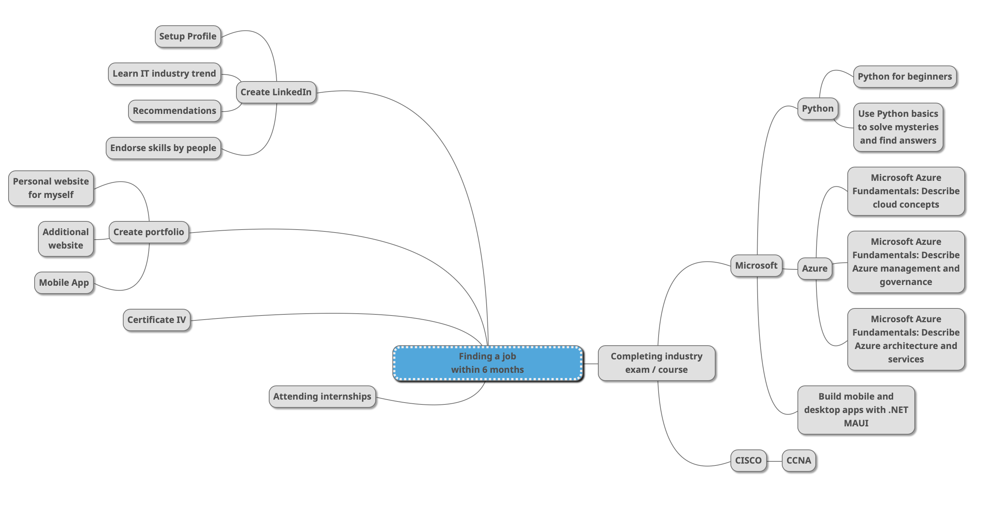

<!-- https://rahuldkjain.github.io/gh-profile-readme-generator/  -->

<h1 align="left">Hi 👋, I'm Cedric Ko</h1>
<h3 align="left">A passionate junior developer.</h3>

### Plan

- 👨‍💻 All of my projects are available at [https://github.com/yacmov?tab=repositories](https://github.com/yacmov?tab=repositories)
- 🔭 I’m currently working on [civ-web-technologies-classes-SK](https://github.com/yacmov/civ-web-technologies-classes-SK)
- 🔭 I’m currently working on [civ-web-technologies-portfolio-phases-SK](https://github.com/yacmov/civ-web-technologies-portfolio-phases-SK)

- 💬 **I want to be a DevOps Engineer**

- 🌱 I’m currently learning **C#, Python**

- 📫 How to reach me **yacmov@gmail.com**

<h3 align="left">Connect with me:</h3>

<h3 align="left">Languages and Tools:</h3>

 
 
 
 
 
 
 
 

 
 

&nbsp;

